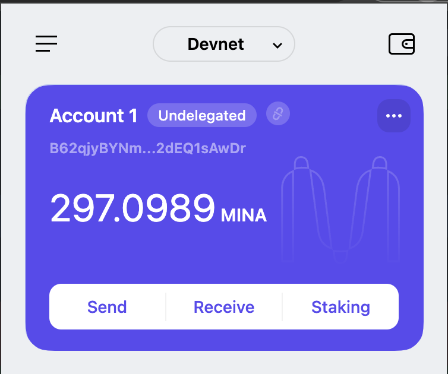
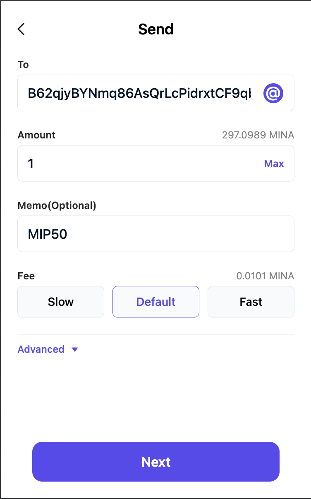
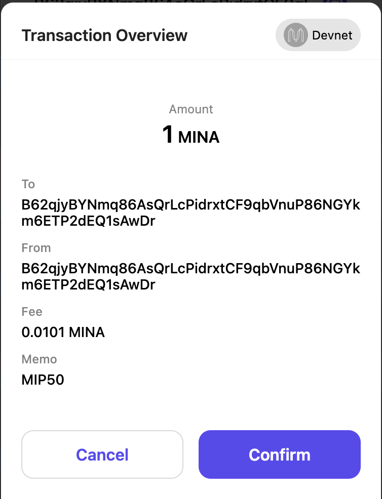

# Mina On-Chain Voting

On-Chain Voting is a protocol developed to help with governing the Mina L1 blockchain.

## Vote With [Auro Wallet](https://www.aurowallet.com/)

1. Ensure you're on the correct network (in this case devnet).
2. Click on your address to copy it to the clipboard (we'll be using it in the next step).
3. Click on "Send."



4. Paste your address into `To`.
5. Add `1` in the `Amount` field.
6. Depending on how you want to cast your vote, enter either `MIP#` or `no MIP#` where `#` is
   substituted with the actual MIP number.



7. Confirm the transaction.



## Protocol Specifications

The On-Chain Voting Protocol is designed to provide community members with a transparent and secure
method of participating in the decision-making process for the Mina blockchain. The aim for this
protocol is to provide stakeholders with the ability to vote on MIPs (Mina Improvement Proposals)
with ease.

(Individual MIPs should be created by following the process described on the
[GitHub repository](https://github.com/MinaProtocol/MIPs).)

### Voting on a MIP

To cast a vote on a particular MIP, a user must send a transaction to **themselves** with a
specially-constructed memo field. The memo field must adhere to the following convention.

**For example:**

```
To vote in favor of 'MIP1', the memo field must be populated with: 'MIP1'
Similarly, if the intent is to vote against 'MIP1', the memo field must
contain: 'no MIP1'.
```

**The transaction amount must be 0, with the user only paying for the transaction fee.**

For more details, see:

- The [article by Granola](https://granola.team/blog/mina-on-chain-voting-results-instructions/)
- The [FAQ](https://forums.minaprotocol.com/t/on-chain-voting-frequently-asked-questions-faq/5959)


## Voting on a MEF

To cast a vote on a particular MEF, a user must send a transaction to **themselves** with a
specially-constructed memo field. The memo field must adhere to the following convention.

**For example:**

```
To vote in favor of 'MEF 1', the memo field must be populated with: 'YES ID 1'
Similarly, if the intent is to vote against 'MEF 1', the memo field must
contain: 'NO ID 1'.
```

*Vote With Auro Wallet*
- Ensure you're on the correct network (e.g., devnet).
- Click on your wallet address to copy it to the clipboard (you’ll need it in step 4).
- Navigate to the Send feature in the wallet.
- In the To field, paste your own wallet address.
- Enter 1 in the Amount field.
- To cast your vote:
   - Enter YES ID # in the Memo field to vote in favor of the proposal.
   - Enter NO ID # in the Memo field to vote against the proposal.
   - Replace # with the actual proposal ID you are voting for.
   - Confirm and submit the transaction. Your vote will be recorded on-chain.

# Proposal Consideration API

## Overview
The **Proposal Consideration API** allows users to fetch detailed data about a proposal, including community votes, staking weights, and vote details within a specified time range.

---

## Endpoint

### `GET /api/mef_proposal_consideration/:id/:start_time/:end_time?ledger_hash`

Retrieve details for a specific proposal within a specified time frame. Optionally, you can configure the ledger hash to compute vote weights.

### Path Parameters
| Parameter    | Type      | Description                                          |
|--------------|-----------|------------------------------------------------------|
| `id`         | `integer` | Unique identifier for the proposal.                  |
| `start_time` | `integer` | Proposal start time in milliseconds unix timestamp.  |
| `end_time`   | `integer` | Proposal end time in milliseconds unix timestamp.    |

### Query Parameters (optional)
| Parameter    | Type      | Description                                          |
|--------------|-----------|------------------------------------------------------|
| `ledger_hash`         | `string` | Ledger hash used to compute weights of the votes.                  |

---

### Response Details

| Field                   | Description                                                    |
|-------------------------|----------------------------------------------------------------|
| `proposal_id`                 | Unique identifier of the proposal.                       |
| `total_community_votes`       | Total number of votes cast by the community.             |
| `total_positive_community_votes` | Total number of positive votes cast by the community. |
| `total_negative_community_votes` | Total number of negative votes cast by the community. |
| `total_stake_weight`    | Total staking weight applied to the proposal.                  |
| `positive_stake_weight` | Staking weight supporting the proposal.                        |
| `negative_stake_weight` | Staking weight opposing the proposal.                          |
| `vote_status`           | Current status of the proposal.                                |
| `elegible`           | Elegible status                               |

---

## Software Development

Install [Nix](https://nixos.org/download) and [direnv](https://direnv.net/docs/installation.html).

The `.envrc` will instruct `direnv` to use Nix to install the prerequisites for development on this
repo.

Without Nix, you will need to install, most notably:

- [just](https://just.systems/man/en/)
- libpq
- rustup
- libiconv
- llvm
- nodejs
- pkg-config
- podman/Docker
- pnpm (and issue `pnpm env use --global 18`)

Configure your `.env` file. See the [`.env.example`](./.env.example).

Optionally issue `just install` to install yet more dependencies.

Issue `just` to see the possible development actions. Examine [Justfile](./Justfile) to see how they
work.

For more information about Diesel and database migrations, see
[the official docs.](https://crates.io/crates/diesel_cli).

## Contributing

Contributions are welcome! This project uses the
[C4 (Collective Code Construction Contract)](https://rfc.zeromq.org/spec/42/) process for
contributions.

## License

This project is licensed under the Mozilla Public License 2.0. See the [LICENSE](./LICENSE) file for
the full license text.
